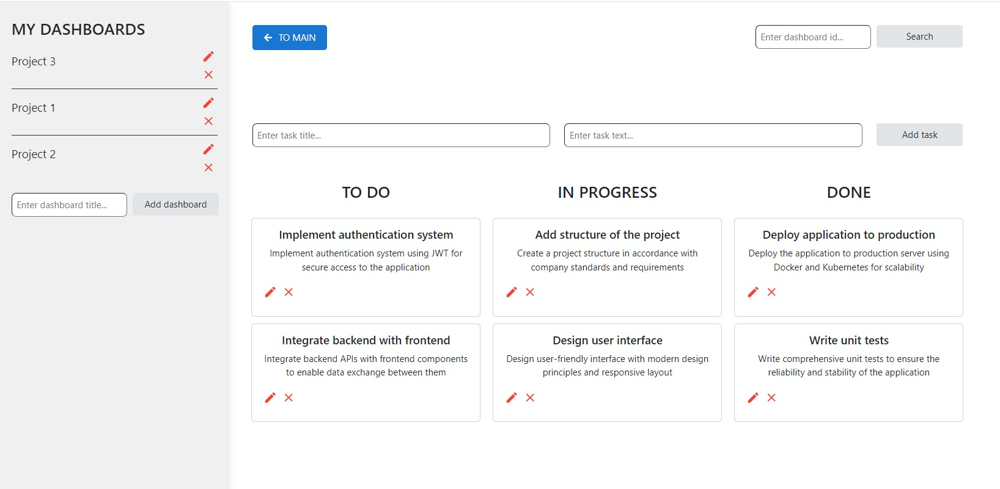

<h1 align="center">Task Management Boards</h1>

Task Management Boards is a web application for organizing tasks into customizable boards. It allows users to create boards, add tasks to them, and move tasks between different statuses.

## Features

- **Create Boards:** Users can create boards to organize their tasks based on different projects, teams, or categories.
- **Delete Boards:** Users can delete boards.
- **Update Board:** User can edit the board name.
- **Search Board:** User can search the board by id.
- **Add Tasks:** Within each board, users can add tasks with titles and descriptions.
- **Manage Tasks:** Tasks can be moved between different statuses (e.g., To Do, In Progress, Done) within a board to reflect their current state.
- **Edit Tasks:** Users can edit task titles and descriptions directly within the application.
- **Delete Tasks:** Tasks can be deleted from boards when they are no longer needed.

## Technologies Used

- **Frontend:** React.js, Redux, React Router, Bootstrap, Formik, Yup, react-beautiful-dnd
- **Backend:** Node.js, Express.js, MongoDB

